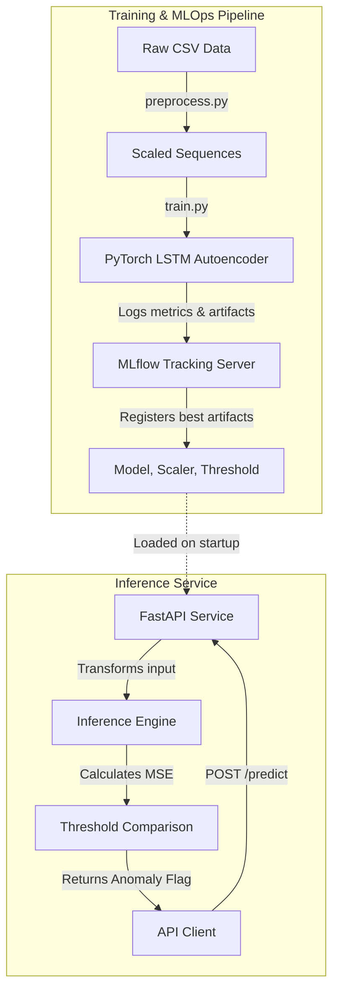

# Time-Series Anomaly Detection API

## Overview

This project builds a production-grade anomaly detection service for univariate time-series data. It trains an LSTM autoencoder on the Numenta Anomaly Benchmark NYC taxi ridership dataset, then exposes the trained detector through a FastAPI REST service containerised with Docker and tracked with MLflow.

LSTM autoencoders are well suited to this problem because they learn a compressed representation of *normal* temporal patterns — the encoder collapses a window of readings into a hidden state, and the decoder reconstructs the original sequence from it. When the model encounters a pattern that diverges from what it learned during training, the reconstruction error rises sharply. By comparing that per-window mean squared error against a percentile-derived threshold, we flag outliers without ever labeling a single training point as anomalous. This makes the approach practical for real-world deployments where labeled anomaly data is scarce.

## Features

| Endpoint | Method | Purpose |
|----------|--------|---------|
| `/health` | GET | Liveness probe — returns `{"status": "ok"}` |
| `/predict` | POST | Accepts a time-series window, returns reconstruction error and anomaly flag |
| `/model-info` | GET | Returns model metadata (window size, dims, threshold) |

## Architecture



## Local Setup

### Prerequisites

- Python 3.12
- Docker (optional, for containerised deployment)

### Environment

```bash
python3 -m venv .venv
source .venv/bin/activate
pip install -r requirements.txt
```

### Train the model

```bash
python train.py
```

This downloads `nyc_taxi.csv` into `data/`, runs 50 epochs of LSTM autoencoder training, logs every epoch's train/val loss to MLflow under the experiment `nyc_taxi_anomaly_detection`, and writes the trained artifacts to `artifacts/`.

### Run the inference API

```bash
uvicorn src.api.main:app --host 0.0.0.0 --port 8000
```

Interactive docs are available at `http://localhost:8000/docs`.

### Browse MLflow runs

```bash
mlflow ui
```

Open `http://localhost:5000` to inspect tracked experiments, parameters, and metrics.

## Docker

### Build and run locally

```bash
docker compose up --build
```

The service starts on port 8000. The container loads artifacts from the `artifacts/` directory baked in at build time — no re-training occurs on startup.

### Published images

Production images are distributed via Docker Hub under the account `rushi5706`. The owner manages tagging and publishing manually; refer to Docker Hub for available tags.

## API Reference

### GET /health

**Response `200`**

```json
{"status": "ok"}
```

---

### POST /predict

**Request body**

```json
{
  "data_point": [<float>, ...]
}
```

`data_point` must contain exactly `window_size` (24) floats representing one 12-hour window of taxi
ridership readings (the dataset is sampled every 30 minutes; 24 steps = 12 hours).

**Response `200`**

```json
{
  "input_data": [<float>, ...],
  "anomaly_score": <float>,
  "is_anomaly": <0 or 1>,
  "threshold": <float>
}
```

**Error `422`** — wrong number of values in `data_point`.

---

### GET /model-info

**Response `200`**

```json
{
  "window_size": 24,
  "hidden_dim": 64,
  "num_layers": 2,
  "threshold": <float>
}
```

## Example curl Requests

Health check:

```bash
curl -s http://localhost:8000/health
```

Predict — real window from the validation split (`values[8256:8280]` from the chronologically sorted dataset,
rows 8256–8279, timestamps `2014-12-20 00:00` through `2014-12-20 11:30`):

```bash
curl -s -X POST http://localhost:8000/predict \
  -H "Content-Type: application/json" \
  -d '{
    "data_point": [
      25976.0, 24322.0, 22993.0, 21186.0, 19390.0, 16298.0,
      14308.0, 12289.0, 10822.0, 6612.0, 4648.0, 3998.0,
      4080.0, 5139.0, 4833.0, 6360.0, 7568.0, 10329.0,
      11646.0, 15228.0, 16173.0, 18920.0, 19813.0, 21529.0
    ]
  }'
```

Actual response (from a live `uvicorn` instance against the committed artifacts, SEED=42):

```json
{
  "input_data": [25976.0, 24322.0, 22993.0, 21186.0, 19390.0, 16298.0, 14308.0,
                 12289.0, 10822.0, 6612.0, 4648.0, 3998.0, 4080.0, 5139.0, 4833.0,
                 6360.0, 7568.0, 10329.0, 11646.0, 15228.0, 16173.0, 18920.0,
                 19813.0, 21529.0],
  "anomaly_score": 0.005520145874470472,
  "is_anomaly": 0,
  "threshold": 0.04163838177919388
}
```

Malformed request (wrong length — returns 422):

```bash
curl -s -X POST http://localhost:8000/predict \
  -H "Content-Type: application/json" \
  -d '{"data_point": [1.0, 2.0, 3.0]}'
```

## Running Tests

```bash
pytest tests/ -v
```

The suite covers:

- `tests/test_data.py` — `create_sequences` output shape and window content; `fit_and_transform` scaler fitted only on the training split.
- `tests/test_models.py` — `LSTMAutoencoder` forward pass preserves input shape across batch sizes and layer configurations.
- `tests/test_api.py` — `/health` exact body, `/predict` response schema and four required keys, wrong-length payload returns 422 (never 500).

## Project Structure

```
.
├── .github/
│   └── workflows/
│       └── ci.yml
├── src/
│   ├── __init__.py
│   ├── data/
│   │   ├── __init__.py
│   │   └── preprocess.py
│   ├── models/
│   │   ├── __init__.py
│   │   └── anomaly_model.py
│   └── api/
│       ├── __init__.py
│       └── main.py
├── tests/
│   ├── test_data.py
│   ├── test_models.py
│   └── test_api.py
├── artifacts/
│   ├── model.pth
│   ├── scaler.joblib
│   └── anomaly_threshold.npy
├── config.yaml
├── requirements.txt
├── train.py
├── Dockerfile
├── .dockerignore
├── docker-compose.yml
├── .env.example
├── .gitignore
└── README.md
```

## Design Decisions

**Chronological train/val split.** Taxi ridership is a non-stationary time series with daily and weekly seasonality. Randomly shuffling before splitting would leak future temporal patterns into the training window — the model would see fragments of future cycles and its validation metrics would be optimistic and misleading. Chronological splitting is the only split that faithfully simulates the deployment scenario where the model sees only past data.

**StandardScaler fitted on the training split only.** Fitting the scaler on the full dataset lets the validation set's statistics (mean, variance) influence the normalization applied to training data. This is a subtle but real form of data leakage — in production the scaler will never have access to future data when it is initialized, so fitting it that way produces a scaler that behaves differently in training than in deployment. Fitting on train only and applying `transform` (not `fit_transform`) to val exactly mirrors what happens at inference time.

**Percentile-based threshold.** A fixed reconstruction-error cutoff chosen by hand would be dataset-specific and brittle. Computing the threshold as a configurable percentile of the validation error distribution makes the decision data-driven and adjustable without retraining: raising `threshold_percentile` (e.g. to 99) tightens the criterion for anomaly flagging; lowering it (e.g. to 90) catches weaker deviations. The percentile is logged to MLflow, and training is seeded (`SEED=42`) so that every run against the same dataset produces the same threshold.
